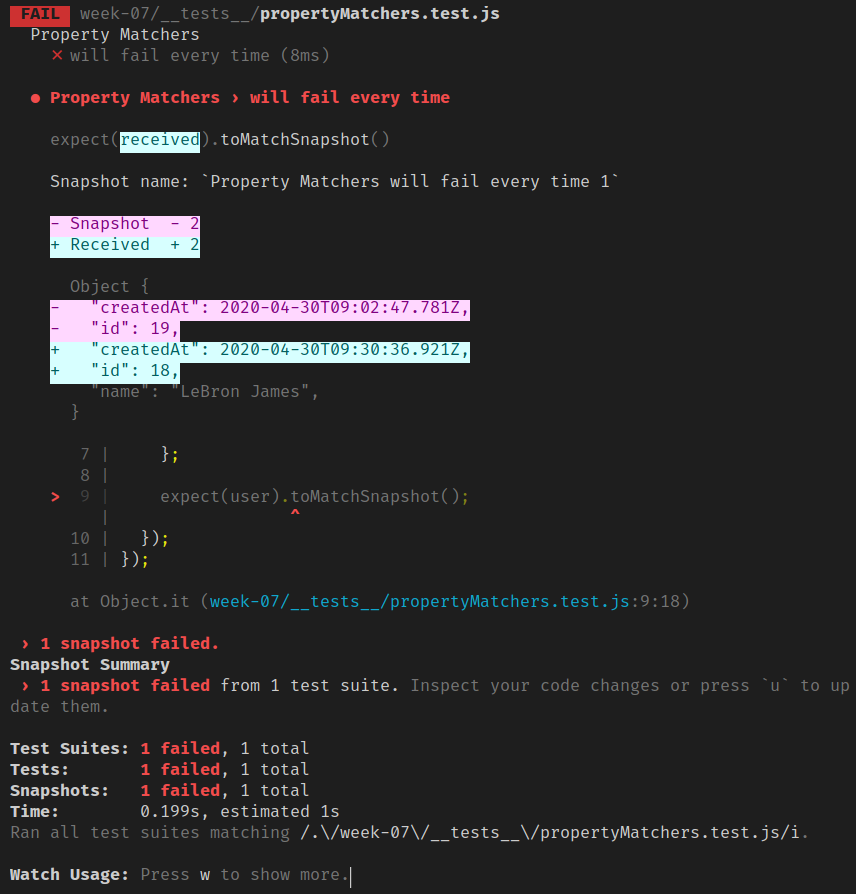
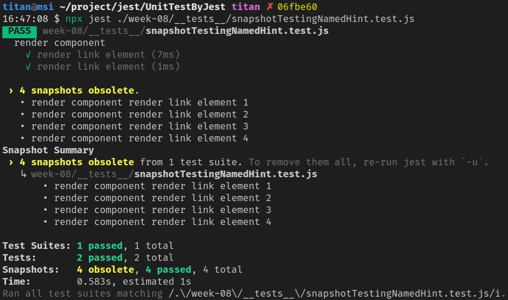

Week 08：Snapshot Testing
===

## Property Matchers

有時 snapshot 的物件中會有生成一些 field (例如：ID 和 Date)，若對這些物件進行 snapshot，就會在執行時常常發生 snapshot 失敗。

```javascript
// __tests__/propertyMatchers.test.js
describe('Property Matchers', () => {
  it('will fail every time', () => {
    const user = {
      name: 'Titan',
      createdAt: new Date(),
      id: Math.floor(Math.random() * 20)
    };

    console.log(user);
  
    expect(user).toMatchSnapshot();
  });
});
```

像上面的測試執行第二次時，snapshot 就會失敗：



所以 Jest 允許你對任何 property 提供 asymmetric matcher。Jest 會在寫入 snapshot 或測試 snapshot 之前，檢查 matcher，然後將 snapshot 儲存至 snapshot 檔案中，而不是 received value：

```javascript
// __tests__/propertyMatchers.test.js
describe('Property Matchers', () => {
  it('will check the matchers and pass', () => {
    const user = {
      name: 'Titan',
      createdAt: new Date(),
      id: Math.floor(Math.random() * 20)
    };

    console.log(user);
  
    expect(user).toMatchSnapshot({
      createdAt: expect.any(Date),
      id: expect.any(Number),
    });
  });
});
```

:::info
asymmetric matcher：在 [Jasmine](https://jasmine.github.io/tutorials/custom_argument_matchers) 也稱為 argument matcher，可用於建立自己的自訂 matcher 來封裝測試邏輯。
:::

下面是 snapshot 儲存的內容：

```javascript
// __tests__/__snapshots__/propertyMatchers.test.js.snap
exports[`Property Matchers will check the matchers and pass 1`] = `
Object {
  "createdAt": Any<Date>,
  "id": Any<Number>,
  "name": "Titan",
}
`;
```

任何非 matcher 的 givin value，會被被明確地檢查並儲存至 snapshot，例如下面測試中的 `name` property：

```javascript
// __tests__/propertyMatchers.test.js
describe('Property Matchers', () => {
  it('will check the values and pass', () => {
    const user = {
      name: 'Titan',
      createdAt: new Date(),
      id: Math.floor(Math.random() * 20)
    };

    console.log(user);
  
    expect(user).toMatchSnapshot({
      name: 'Titan',
      createdAt: expect.any(Date),
      id: expect.any(Number),
    });
  });
});
```

下面是 snapshot 儲存的內容：

```javascript
// __tests__/__snapshots__/propertyMatchers.test.js.snap
exports[`Property Matchers will check the values and pass 1`] = `
Object {
  "createdAt": Any<Date>,
  "id": Any<Number>,
  "name": "Titan",
}
`;
```

## `.toMatchSnapshot(propertyMatchers?, hint?)`

確保值與最新的 snapshot 可以 match。

- `propertyMatchers`：可選的物件 argument
  - 若 received value 是物件 instance，則該 argument 會有 asymmetric matcher 作為 expected property 的子集合的值
  - 很像 `toMatchObject`，會為子集合的 property 設定彈性條件，然後進行 snapshot testing 時，會作為其餘 property 的明確條件
- `hint`：可選的字串 argument
  - `hint` 會加在測試名稱之後
  - Jest 會在 snapshot 名稱的最後加上一個數字
    - 但敘述提示會比數字更好，可用來區分在一個 `it` 或 `test` 區塊中的多個 snapshot
  - Jest 會在對應的 `.snap` 檔案中依名稱來對 snapshot 進行排序

例如：

故意讓 `describe` 內的兩個 `it` 是一樣的測試名稱，共有 4 個 `it`，都是用 `toMatchSnapshot()` matcher。

```javascript
// __tests__/snapshotTestingNamedHint.test.js
import { rendererLinkElement } from "../src/renderElement";

describe("render component", () => {
  it("render link element", () => {
    let url = 'https://titangene.github.io/';
    let linkName = 'Titangene Blog';
  
    let actual = rendererLinkElement(url, linkName);

    expect(actual).toMatchSnapshot();
    expect(actual).toMatchSnapshot();
  });

  it("render link element", () => {
    let url = 'https://www.google.com/';
    let linkName = 'Google';
  
    let actual = rendererLinkElement(url, linkName);

    expect(actual).toMatchSnapshot();
    expect(actual).toMatchSnapshot();
  });
});
```

生成的 snapshot 檔案內會有 4 個 snapshot：
- snapshot 名稱都是會以 `describe` 和 `it` / `test` 的名稱為前綴
- 並會在測試名稱相同的後面自動加上數字編號
- 同名的 `it` 或 `test` 測試會接序編號

但數字比較不好讀 (應該說本來測試名稱本來就不能相同，但若一個 `it` 或 `test` 內使用多個 `toMatchSnapshot` 時，就會有自動編號)：

```javascript
// __tests__/__snapshots__/snapshotTestingNamedHint.test.js.snap
// Jest Snapshot v1, https://goo.gl/fbAQLP

exports[`render component render link element 1`] = `"<a href=\\"https://titangene.github.io/\\">Titangene Blog</a>"`;

exports[`render component render link element 2`] = `"<a href=\\"https://titangene.github.io/\\">Titangene Blog</a>"`;

exports[`render component render link element 3`] = `"<a href=\\"https://www.google.com/\\">Google</a>"`;

exports[`render component render link element 4`] = `"<a href=\\"https://www.google.com/\\">Google</a>"`;
```

所以建議在使用 `toMatchSnapshot()` matcher 時，加上 `hint` argument：

```diff
// __tests__/snapshotTestingNamedHint.test.js
import { rendererLinkElement } from "../src/renderElement";

describe("render component", () => {
  it("render link element", () => {
    let url = 'https://titangene.github.io/';
    let linkName = 'Titangene Blog';
  
    let actual = rendererLinkElement(url, linkName);

-   expect(actual).toMatchSnapshot();
-   expect(actual).toMatchSnapshot();
+   expect(actual).toMatchSnapshot('rendor Titangene Blog (First Test)');
+   expect(actual).toMatchSnapshot('rendor Titangene Blog (Second Test)');
  });

  it("render link element", () => {
    let url = 'https://www.google.com/';
    let linkName = 'Google';
  
    let actual = rendererLinkElement(url, linkName);

-   expect(actual).toMatchSnapshot();
-   expect(actual).toMatchSnapshot();
+   expect(actual).toMatchSnapshot('rendor Google (First Test)');
+   expect(actual).toMatchSnapshot('rendor Google (Second Test)');
  });
});
```

:::info
在修改測試名稱時，記得更新舊的 snapshot，因為不同名稱的測試會建立各別的 snapshot，舊的 snapshot 就變成過時 (obsolete) 狀態。

在執行測試時，Jest 會提醒你哪些 snapshot 是過時 (obsolete) 狀態：



若要更新舊的 (也就是刪除舊的) snapshot，Jest 也會提醒你要記得要在執行 Jest 時用 `-u` option：

```shell
$ jest -u
```

:::

更新 snapshot 後，就會只看到以下這些 snapshot：

```javascript
// __tests__/__snapshots__/snapshotTestingNamedHint.test.js.snap
// Jest Snapshot v1, https://goo.gl/fbAQLP

exports[`render component render link element: rendor Google (First Test) 1`] = `"<a href=\\"https://www.google.com/\\">Google</a>"`;

exports[`render component render link element: rendor Google (Second Test) 1`] = `"<a href=\\"https://www.google.com/\\">Google</a>"`;

exports[`render component render link element: rendor Titangene Blog (First Test) 1`] = `"<a href=\\"https://titangene.github.io/\\">Titangene Blog</a>"`;

exports[`render component render link element: rendor Titangene Blog (Second Test) 1`] = `"<a href=\\"https://titangene.github.io/\\">Titangene Blog</a>"`;
```

## `.toThrowErrorMatchingSnapshot(hint?)`

測試函數在呼叫時拋出與最新 snapshot match 的 error。

建議加上 `hint` argument，用於描述 snapshot。

> `hint` argument 的說明可參閱 [`.toMatchSnapshot(propertyMatchers?, hint?)`](#tomatchsnapshotpropertymatchers-hint) 部份。

```javascript
// __tests__/toThrowErrorMatchingSnapshot.test.js
class DisgustingFlavorError extends Error {}

function drinkFlavor(flavor) {
  if (flavor == 'octopus') {
    throw new DisgustingFlavorError('yuck, octopus flavor');
  }
  console.log('drinkFlavor');
}

describe('toThrowErrorMatchingSnapshot', () => {
  it('throws on octopus', () => {
    function drinkOctopus() {
      drinkFlavor('octopus');
    }
  
    expect(drinkOctopus).toThrowErrorMatchingSnapshot();
  });
});
```

執行第一次測試會建立以下 snapshot：

```javascript
// __tests__/__snapshots__/toThrowErrorMatchingSnapshot.test.js.snap
// Jest Snapshot v1, https://goo.gl/fbAQLP

exports[`toThrowErrorMatchingSnapshot throws on octopus 1`] = `"yuck, octopus flavor"`;
```

## `.toThrowErrorMatchingInlineSnapshot(inlineSnapshot)`

測試函數在呼叫時拋出與最新 snapshot match 的 error。

> inline snapshot 可參閱之前介紹的 [inline snapshot](https://github.com/DeepJavaScript/UnitTestByJest/tree/titan/week-07#inline-snapshots)。

## 最佳實踐

可用來識別應用程式中意外的 interface 變化，可以是以下這些 interface：
- API response
- UI
- logs
- error 訊息

### 1. 把 snapshot 當成程式碼

commit 和 review snapshot，作為平常 code review 過程的一部份，也就是將 snapshot 視為專案中的任何類型測試或程式碼。

透過 focus 和 short snapshot，並使用強制執行這些風格慣例的工具，以確保 snapshot 的可讀性。

Jest 使用 `pretty-format` 讓 snapshot 更易讀，但也可以引入其他工具，例如：`eslint-plugin-jest` 的 `no-large-snapshots` option，或元件 snapshot 比較功能 `snapshot-diff`，以促進 commit 、foucs assertion。

### 2. 測試應是確定的

只要元件沒有更改，執行相同的測試就會有相同的結果，不應該讓不同平台或其他不確定來讓結果不同。

如果有一個 [Clock](https://github.com/facebook/jest/blob/master/examples/snapshot/Clock.react.js) 元件使用 `Date.now()`，每次執行的測試就會生成不同的 snapshot。這種情境可以 mock `Date.now` 方法，來讓每次執行測試都會回傳一樣的值：

```javascript
Date.now = jest.fn(() => 1482363367071);
```

這樣元件就會生成一樣的 snapshot，與測試何時執行無關。

### 3. 使用描述性的 snapshot 名稱

應對 snapshot 設定描述性的測試和/或 snapshot 名稱，名稱應描述預期的 snapshot 內容。

這樣 reviewer 才能更易於驗證 snapshot，且任何人都可以從更新知道過期的 snapshot 是否是正確的行為。

例如：

下面的 snapshot 無法直接從 snapshot 名稱看出來預期內容：

```javascript
exports[`<UserName /> should handle some test case`] = `null`;

exports[`<UserName /> should handle some other test case`] = `
<div>
  Alan Turing
</div>
`;
```

下面的就可以：

```javascript
exports[`<UserName /> should render null`] = `null`;

exports[`<UserName /> should render Alan Turing`] = `
<div>
  Alan Turing
</div>
`;
```

所以只要預期與 snapshot 內容不同，就能馬上看出錯誤：

```javascript
exports[`<UserName /> should render null`] = `
<div>
  Alan Turing
</div>
`;

exports[`<UserName /> should render Alan Turing`] = `null`;
```

## 常見問題

### snapshot 在 CI 系統上自動 written 嗎？

不行。在 Jest 20 中，當 Jest 在 CI 系統中執行測試時沒有使用 `--updateSnapshot`，snapshot 就不會自動 written。

所有 snapshot 都是在 CI 上執行的程式碼中的一部份，並且因新的 snapshot 會自動通過，所以 snapshot 不應透過 CI 系統上的測試執行。

建議 commit 所有 snapshot，並將它們儲存在版本控制中。

### 是否應 commit snapshot 檔案？

對，所有 snapshot 檔案都應該與它們所覆蓋的模組和測次一起 commit。應將 snapshot 視為測試的一部份，就很像 Jest 中的任何 assertion 值。

snapshot 可代表模組在任何時間點的狀態。當修改模組時，Jest 可以告訴你與前一個版本之間的差異。

還可在 code review 期間提供很多額外的 context，讓 reviewer 更好讀你的變更。

### snapshot testing 是否只在 React 元件上運作？

不是，snapshot 可捕捉任何可序列化的值，可在測試輸出是否正確時使用。

> Jest repo 包含很多測試 Jest 本身的輸出、Jest 的 assertion library 的輸出，以及來自 Jest codebase 各部份的 log 訊息的範例。
> 可參閱 Jest repo 中的 [snapshotting CLI output](https://github.com/facebook/jest/blob/master/e2e/__tests__/console.test.ts) 的範例。

### snapshot testing 和 visual regression testing 的區別？

兩種是完全不同的測試 UI 的方法，各有不同用途：
- visual regression testing (視覺回歸測試)：會擷取網頁的截圖，然後比對每個 px
- snapshot testing：進行序列化，並儲存在 text 檔，並用 diff 演算法比較

> [Jest blog](https://jestjs.io/blog/2016/07/27/jest-14.html#why-snapshot-testing) 列出建置 snapshot testing 的原因

### snapshot testing 是否會取代單元測試？

snapshot testing 只是 Jest 附帶的 20 個多 assertion 中的一個。snapshot testing 的目的不是取代現有的單元測試，而是提供額外的價值，並使測試更輕鬆。在某些場景中，snapshot testing 可以消除對特定功能 (例如：React 元件) 的單元測試的需求，但他們可以一起使用。

### 關於生成檔案的速度和大小，效能如何？

因 snapshot 會儲存在 text 檔中，所以很快且可靠。

Jest 會為 invoke `toMatchSnapshot` matcher 的每個測試檔案生成一個新檔案。snapshot 大小很小，像 Jest codebase 的所有 snapshot 檔案大小都小於 300KB。

### 如何解決 snapshot 檔案中的衝突？

snapshot 檔案必須代表它們所覆蓋的模組的當前狀態。如果要合併兩個分支，且在 snapshot 檔案中遇到衝突時，可以手動解決，或透過執行 Jest 並檢查結果來更新 snapshot 檔案。

### 是否能將 snapshot testing 應用在 TDD？

雖然可以手動寫 snapshot 檔案，但通常這些檔案是不可存取的。

snapshot 有助於判斷測試覆蓋的模組輸出使否發生變化，而不是先為程式碼的設計提供指導。

### 程式碼覆蓋率是否能和 snapshot 測試一起運作？

可以，和其他測試一樣。
